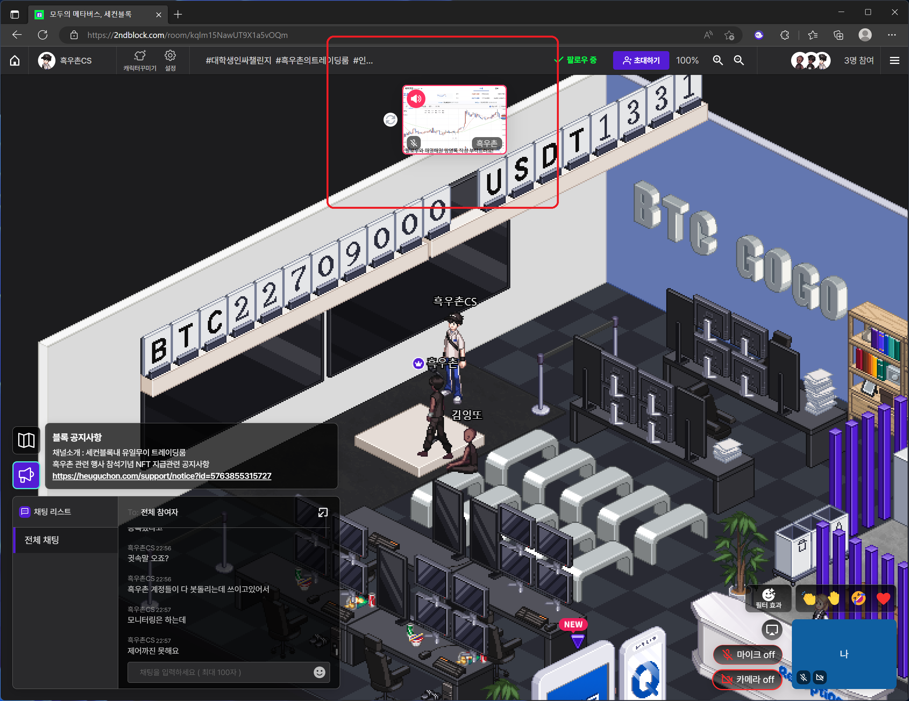
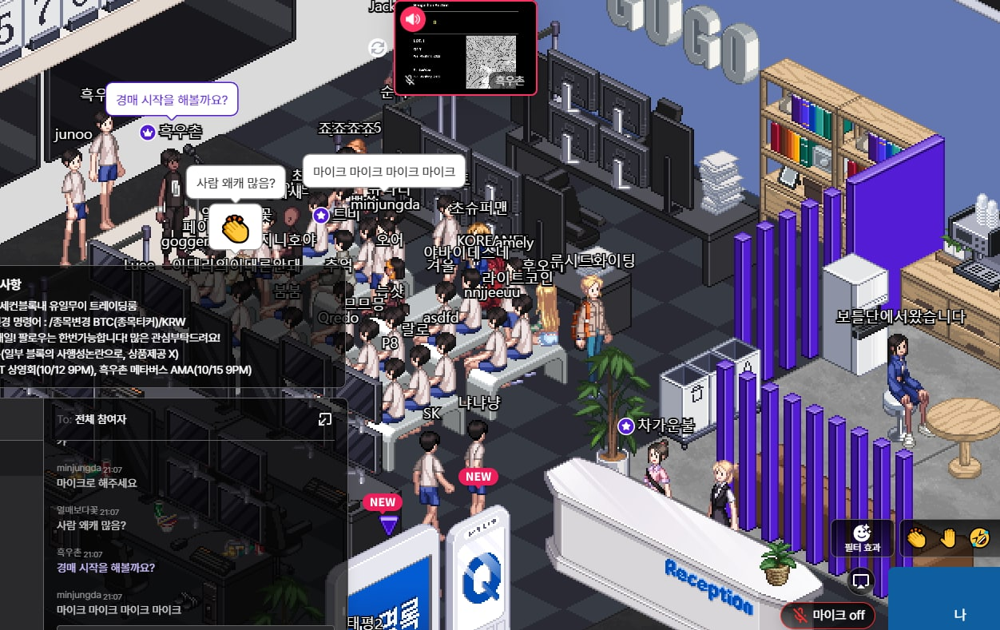
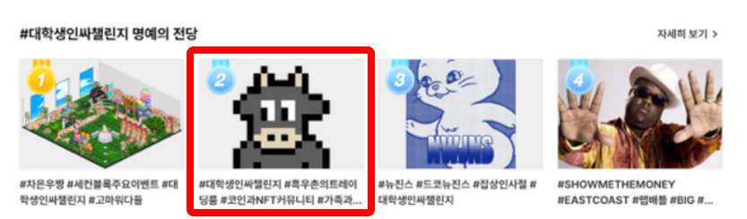
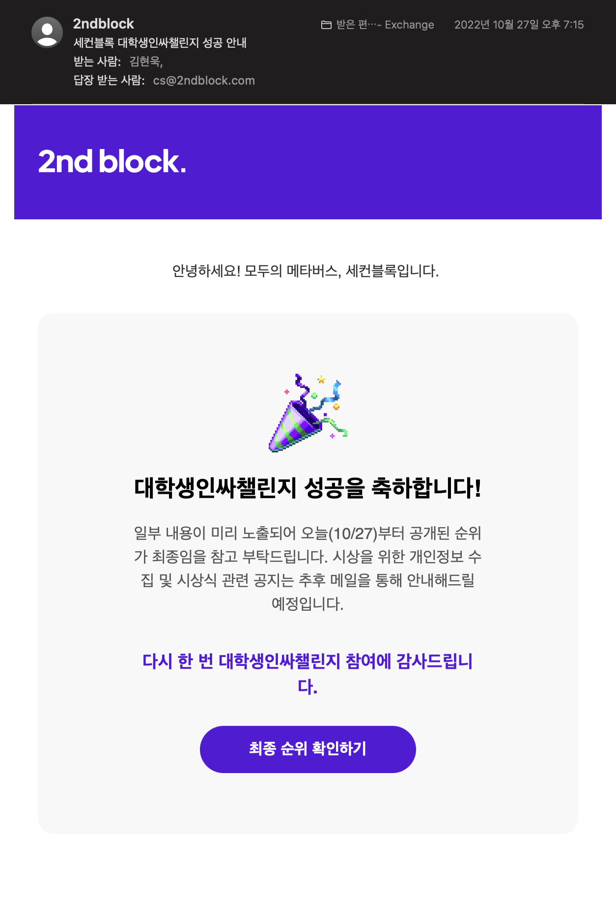

# 세컨블록 블록 관리 툴

## 세컨블록

### 개요
[세컨블록](https://2ndblock.com)은 한국의 가상자산 거래소인 [업비트](https://upbit.com)의 운영사 두나무에서 운영중인 메타버스 플랫폼이다.  
픽셀 감성이 묻어나는 나만의 공간에서 나의 개성과 취향이 담긴 캐릭터를 이용해 다양한 사람들과 더 즐겁고 특별하게 소통할 수 있는 공간이다.

### 챌린지
> 어떠한 행동을 취한 것을 인증한 후, 다음 주자를 지목하여 의도한 행동을 유행시키는 일종의 마케팅 방식.

세컨블록의 챌린지란 [나무위키](https://namu.wiki)의 [챌린지](https://namu.wiki/w/%EC%B1%8C%EB%A6%B0%EC%A7%80#s-3.4) 문서 3.4 항목에 서술되어 있는 용례라고 볼 수 있다.  
세컨블록 이용 활성화를 위해 두나무에서 이벤트성 마케팅을 챌린지 형태로 진행하고 있다. 

| 챌린지명                | 기간                           | 주소    |
|-----------------------|------------------------------|-------|
| 대학생 인싸 챌린지         | 2022년 9월 29일 ~ 2022년 10월 21일 | https://2ndblock.com/events/inssa  |
| 방구석 전문가 메타버스 챌린지 | 2022년 12월 5일 ~ 2023년 1월 6일   | https://2ndblock.com/events/expert  |

## 프로젝트

### 개요
세컨블록 챌린지는 상금으로 비트코인을 받을 수 있고, 대학생 인싸 챌린지의 경우는 1등을 한 경우 두나무 메타버스실 인턴 지원시 서류전형 면제라는 매우 메리트가 큰 이벤트이다.  
챌린지 우승을 위해 방 개념인 **블록**에서 세컨블록 유저들이 팔로우와 방명록 작성을 하도록 유도하는 행사들을 기획하였고  
원할한 행사 운영과 부실한 세컨블록의 기능을 극복하기 위해 별도의 블록 관리 프로그램(툴)을 만들어 챌린지에 참여중이다.

### 행사 기획
#### 대학생 인싸 챌린지
| 행사명 | 날짜 | 내용                                                                                    |
|-----------------|-----------------|---------------------------------------------------------------------------------------|
| 업비트 NFT 모의경매 | 2022년 10월 12일 | 업비트 NFT 수집가인 흑우촌이 보유중인 NFT 작품을 단순히 전시하는 것을 넘어 가상의 포인트로 모의경매 게임을 진행                    |
| 흑우촌 메타버스 AMA | 2022년 10월 15일 | 정식 공개 예정인 메타버스 커뮤니티 [흑우촌](https://heuguchon.com)에 대한 궁금증을 해소하는 무엇이든 물어보세요 행사인 AMA를 진행 |

#### 방구석 전문가 메타버스 챌린지
| 행사명                           | 날짜             | 내용                                                                                      |
|-------------------------------|----------------|-----------------------------------------------------------------------------------------|
| 흑우촌 관련 행사 참석 기념 NFT 화이트리스트 접수 | 2022년 12월 6일 ~ | 앞의 대학생 인싸 챌린지의 두 행사에 참여한 흑우촌 커뮤니티 지지자분들께 감사의 마음을 담아 참석기념 NFT를 증정하고자 이더리움 지갑 주소를 접수받고 있음 |

### 기능
| 기능명 | 주요기술 | 내용 | 예시 |
|----|----------|-----| ---- |
| 차트 출력 | Selenium | 세컨블록의 화상공유 또는 스크린공유 기능을 통해 블록에 있는 유저가 전체 채팅창에서 특정 종목을 입력하면 업비트 거래소에서 해당 종목의 차트를 출력한다. ex) '**/종목변경** BTC/KRW' |  |
| 모의 경매 | Selenium, Flask | 세컨블록의 화상공유 또는 스크린공유 기능을 통해 현재 경매 상황을 볼 수 있고, 블록에 있는 유저가 채팅 커맨드로 경매 게임에 참여할 수 있다.  **경매규칙** 참가자들은 각자 가상의 포인트인 1,000,000 HD를 지급 받아, 소지금 내에서 출품된 작품들을 입찰할 수 있다.  채팅 명령어로 입찰에 참여할 수 있으며, 실제 경매장과 같이 경매 상황을 실시간으로 관전할 수 있다.  **채팅 명령어** 1. **/등록** 모의경매 참여에 필요한 가상의 포인트를 지급받는다. 2. **/입찰** (금액) 입찰 진행중인 작품을 얼마에 입찰할 것인지 입찰의사를 밝힌다. |  | 

## 실적
### 대학생 인싸 챌린지
* 명예의 전당(2등)

* 시상관련 이메일
